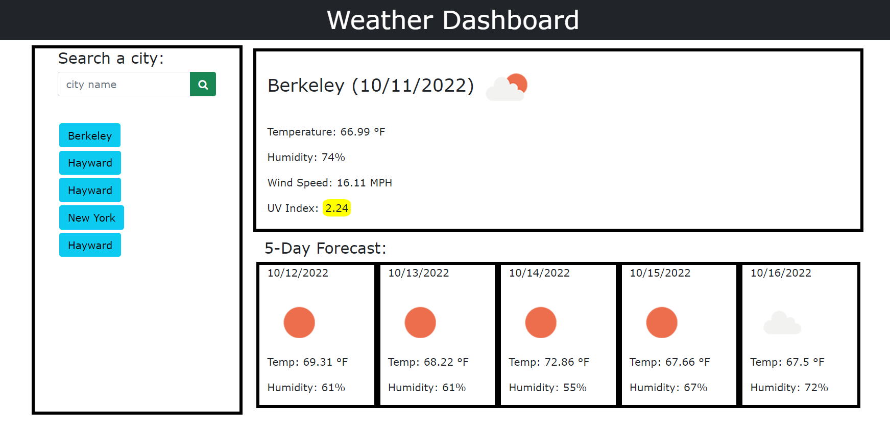

# Weather-Dashboard

# Description

Javascript is used by programmers across the world to create dynamic and interactive web content like applications and browsers. JavaScript is so popular that it's the most used programming language in the world, used as a client-side programming language by 97.0% of all websites

The reason for building this specific project was the need for an application that displays the weather outlook for a selected city.

The OpenWeather API was used for retrieving the current day's temperature, humidity, wind speed, and uv index. It was also used to display the temperature and humidity for the following 5 days.

The Webpage can easily access through this link[]

# Table of Content

1. [HomePage](#homepage)
2. [Features](#features)
3. [CodeSnippet](#codesnippet)
4. [Tools](#tools)
5. [Prerequisites](#prerequisites)
6. [AuthorLinks](#authorlinks)

# HomePage



# Features

- On first use the application will only display the Weather Dashboard header and a search field.
- Type in the name of the city for which you would like weather information.
- You will then see a display with the city name, current date, temp, humidity, wind speed, uv index, and an icon representing the weather conditions.

# CodeSnippet

```get city coordinates
$(document).on("click", ".prvCity", function (e) {
    e.preventDefault();
    var cityName = $(this).attr("id");
    var apiKey = "6406ca836e96fe35d13d0645f945ad0b";
    var queryURL =
      "https://api.openweathermap.org/data/2.5/weather?q=" +
      cityName +
      "&cnt=5&units=imperial&appid=" +
      apiKey;
    $.ajax({
      url: queryURL,
      method: "GET",
    }).then(function (results) {
      weatherForecast(results);
    });
  });

  searchBtn.on("click", function (e) {
    e.preventDefault();
    var cityName = $("#userInput").val();
    var apiKey = "6406ca836e96fe35d13d0645f945ad0b";
    var queryURL =
      "https://api.openweathermap.org/data/2.5/weather?q=" +
      cityName +
      "&cnt=5&units=imperial&appid=" +
      apiKey;
    $.ajax({
      url: queryURL,
      method: "GET",
    }).then(function (results) {
      weatherForecast(results);
      addToSearchHist(results.name);
    });
    $("#userInput").val("");
  });

  function weatherForecast(results) {
    $(".hide").attr("class", "row");
    var currentCityName = results.name;
    $("#currentCityInfo").text(currentCityName + " ");
    var currentCityLon = results.coord.lon;
    var currentCityLat = results.coord.lat;
    findWithCoords(currentCityLat, currentCityLon);
    var currentCityDt = results.sys.sunrise;
    dateConverter(currentCityDt);
    var currentWethIcon = results.weather[0].icon;
    weatherIcon(currentWethIcon);
  }

  function findWithCoords(currentCityCoLat, currentCityCoLon) {
    var apiKey = "6406ca836e96fe35d13d0645f945ad0b";
    var queryURL2 =
      "https://api.openweathermap.org/data/2.5/onecall?lat=" +
      currentCityCoLat +
      "&lon=" +
      currentCityCoLon +
      "&exclude=minutely,hourly&units=imperial&appid=" +
      apiKey;
    $.ajax({
      url: queryURL2,
      method: "GET",
    }).then(function (results) {
      var currentCityTemp = results.current.temp;
      $("#currentTemp").text("Temperature: " + currentCityTemp + " \u00B0F");
      var currentCityHum = results.current.humidity;
      $("#currentHumid").text("Humidity: " + currentCityHum + "%");
      var currentCityWinSpeed = results.current.wind_speed;
      $("#currentWind").text("Wind Speed: " + currentCityWinSpeed + " MPH");
      var currentCityUvi = results.current.uvi;
      uviIndexSeverity(currentCityUvi);
      fiveDayForecast(results);
    });
  }


```

```convertint unix time to actual date
function dateConverter(dt) {
    var inMilliseconds = dt * 1000;
    var inDateFormat = new Date(inMilliseconds);
    var currentIntMonth = inDateFormat.getMonth() + 1;
    var currentIntDay = inDateFormat.getDate();
    var currentIntYear = inDateFormat.getFullYear();
    $("#currentCityInfo").append(
      "<span>" +
        "(" +
        currentIntMonth +
        "/" +
        currentIntDay +
        "/" +
        currentIntYear +
        ")" +
        "</span>"
    );
  }

```

# Tools

1. VsCode
2. Git (windows)
3. Github

# Prerequisites

Software need to be install

- Vscode
- git
- github(clone project)

# AuthorLinks

[Github](https://github.com/akash2040/Weather-Dashboard)
